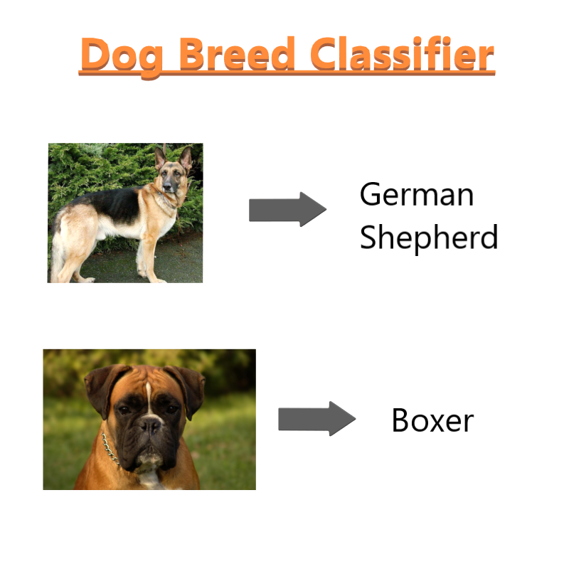

# Dog Breed Classifier
Building a funny Dog breed classifier model using **Deep Learning**.
\
\
\

# Overview
The model predicts the given image into its appropriate dog breed.

The model also classifies between Human or not Human and matches the human to similar kind of Dog breed like this :\
`Hello, Human!
You look like a...
Bloodhound`

The model uses **VGG16** architecture as the **Transfer Learning** process.

# Dependencies
* Python
* PyTorch
* Numpy
* Matplotlib

# Steps involved
1. Load and preprocessing the data 
2. Detecting human faces
3. Building the model
4. Training and validating the model
5. Testing the model
6. Prediction
